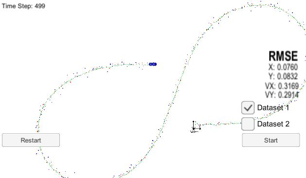
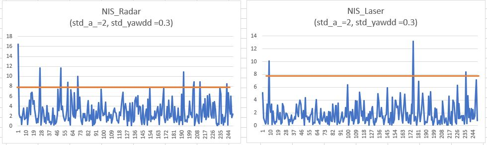
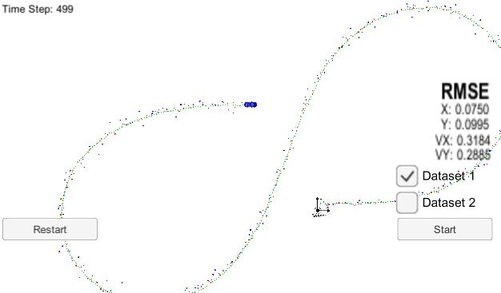
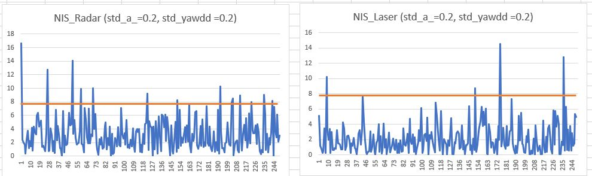

# Unscented Kalman Filter Project Starter Code
Self-Driving Car Engineer Nanodegree Program

Self-Driving Car Engineer Nanodegree Program -Term2 Project2 

My code built without error with cmake .. && make, and connected to GUI with ./UnscentedKF. 

With fusion LASER and RADAR data, the px,py,vx,vy RMSE = [.0760,.0832,.3169,.2914], less than the requirement [0.09,0.10,0.40,0.30].  Parameters noise std_a(lonitudinal acceleration noise standard deviation) = 2 and std_yawdd(yaw acceleration noise standard deviation) =0.3.

Its NIS (nomarlized innvoation square) are 

I also tried smaller process noise std_a=0.2 and std_yawdd=0.2. NeitherNIS nor RMSE improves much. So I kept std_a=2 and std_yawdd=0.3 as default parameters choices. 

Its NIS (nomarlized innvoation square) is 

